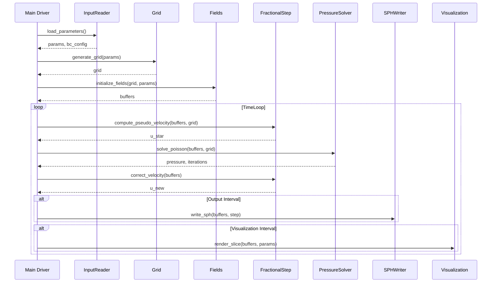
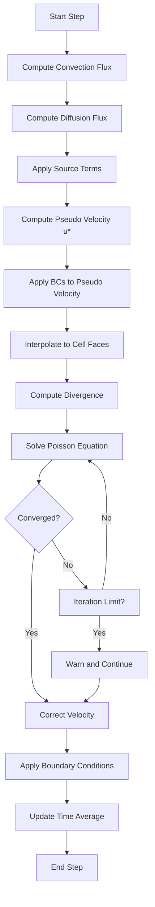
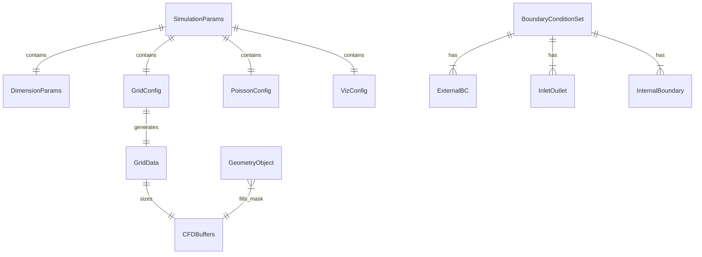

# Technical Design Document

## Overview

**Purpose**: クリーンルーム内微小粒子の発生源特定を目的とした3次元CFDソルバー。弱圧縮性を考慮した非圧縮性Navier-Stokes方程式をLES（標準Smagorinskyモデル）で解き、後段のBackward FTLE + Backward LPT解析用の速度場データを生成する。

**Users**: シミュレーションエンジニアが計算パラメータをJSON形式で設定し、クリーンルーム環境の流れ場解析を実行する。

**Impact**: 新規開発。参考実装（H2/src/熱解析コード）のアーキテクチャパターンを継承しつつ、CFDソルバー固有の機能（対流項WENO3、Fractional Step法、LESモデル等）を実装する。

### Goals

- 3次元直交格子上で弱圧縮性Navier-Stokes方程式を解く
- WENO3スキームによる高精度対流項離散化
- 非等間隔Z方向格子のサポート
- JSON入力/SPHバイナリ出力によるワークフロー統合
- 将来の分散並列計算への拡張性確保

### Non-Goals

- 移動物体・回転物体のサポート
- 非構造格子のサポート
- GPU並列化（将来課題）
- 粒子追跡（後段解析として分離）

---

## Architecture

### Architecture Pattern & Boundary Map

**Selected Pattern**: Modular Monolith（モジュール分離型モノリス）

参考実装（H2/src/）で実証されたパターンを継承。Juliaのモジュールシステムを活用し、責務ごとにモジュールを分離しつつ単一パッケージ内で管理する。

```mermaid
graph TB
    subgraph Main["Main Driver"]
        Driver[CleanroomSolver.jl]
    end

    subgraph Core["Core Modules"]
        Common[Common.jl]
        Grid[Grid.jl]
        Fields[Fields.jl]
    end

    subgraph Physics["Physics Modules"]
        Convection[Convection.jl]
        Diffusion[Diffusion.jl]
        Turbulence[Turbulence.jl]
        Pressure[PressureSolver.jl]
        FracStep[FractionalStep.jl]
    end

    subgraph BC["Boundary Conditions"]
        BoundaryCore[BoundaryConditions.jl]
        Geometry[Geometry.jl]
    end

    subgraph IO["Input/Output"]
        JSONInput[InputReader.jl]
        SPHOutput[SPHWriter.jl]
        Checkpoint[Checkpoint.jl]
        Monitor[Monitor.jl]
        Visualization[Visualization.jl]
    end

    subgraph TimeInt["Time Integration"]
        TimeScheme[TimeIntegration.jl]
    end

    Driver --> Core
    Driver --> Physics
    Driver --> BC
    Driver --> IO
    Driver --> TimeInt

    Physics --> Core
    BC --> Core
    IO --> Core
    TimeInt --> Physics
</mermaid>
```

**Architecture Integration**:
- **Selected pattern**: Modular Monolith — 参考実装で実証済み、Juliaモジュールシステムに適合
- **Domain boundaries**: Core（基盤）、Physics（物理モデル）、BC（境界条件）、IO（入出力）、TimeInt（時間積分）
- **Existing patterns preserved**: WorkBuffers構造体、FLoops並列化、境界条件struct
- **New components rationale**: 対流項WENO3、Fractional Step法、LESモデルはCFD固有
- **Steering compliance**: Julia開発、モジュール化、HALO領域設計

### Technology Stack

| Layer | Choice / Version | Role in Feature | Notes |
|-------|------------------|-----------------|-------|
| Language | Julia 1.10+ | 主要開発言語 | 高性能数値計算 |
| Parallelization | FLoops.jl | スレッド並列抽象化 | SequentialEx/ThreadedEx切り替え |
| Linear Algebra | LinearAlgebra.jl | 行列・ベクトル演算 | 標準ライブラリ |
| JSON Parsing | JSON3.jl | 入力パラメータ読込 | 高性能JSONパーサー |
| Visualization | CairoMakie.jl | 静的画像出力 | PNG/SVG対応、**weakdep** |
| File I/O | Base.IO | バイナリ入出力 | SPH/チェックポイント |
| Environment | Project.toml | 依存管理 | Julia標準 |

### Package Extensions構成

CairoMakieの初回コンパイル遅延（Time-to-First-Plot問題）を回避するため、Julia 1.9+のPackage Extensions機能を採用する。可視化を行わない計算のみのジョブでは高速に起動できる。

```toml
# Project.toml
[deps]
FLoops = "..."
JSON3 = "..."
LinearAlgebra = "..."

[weakdeps]
CairoMakie = "..."

[extensions]
CleanroomVisualizationExt = "CairoMakie"
```

```
# ディレクトリ構成
src/
├── CleanroomSolver.jl      # メインモジュール
├── Visualization.jl        # 可視化インターフェース（stub）
└── ...
ext/
└── CleanroomVisualizationExt.jl  # CairoMakie依存の実装
```

**動作**:
- `using CairoMakie` なしで `CleanroomSolver` を読み込む場合: Visualization機能は無効（stub関数がエラーを返す）
- `using CairoMakie, CleanroomSolver` の場合: 拡張モジュールが自動ロードされ、可視化機能が有効化

---

## System Flows

### メインタイムループ



### Fractional Step法の詳細フロー



---

## Requirements Traceability

| Requirement | Summary | Components | Interfaces | Flows |
|-------------|---------|------------|------------|-------|
| 1.1-1.7 | 計算格子生成 | Grid | GridConfig | Grid Generation |
| 2.1-2.3 | 支配方程式・LES | Convection, Diffusion, Turbulence | FluxInterface | TimeLoop |
| 3.1-3.4 | 無次元化 | Common, Fields | DimensionConverter | Initialization, Output |
| 4.1-4.5 | 空間離散化WENO3 | Convection | WENO3Reconstructor | Flux Computation |
| 5.1-5.3 | 時間積分 | TimeIntegration | TimeSchemeInterface | TimeLoop |
| 6.1-6.5 | 圧力-速度分離 | FractionalStep | FracStepInterface | FracStep Flow |
| 7.1-7.6 | 圧力ポアソン | PressureSolver | PoissonInterface | Poisson Solve |
| 8.1-8.6 | 境界条件 | BoundaryConditions | BCInterface | BC Application |
| 9.1-9.8 | 物体表現 | Geometry | GeometryInterface | Preprocessing |
| 10.1 | HALO領域 | Grid, Fields | HALOInterface | Grid Generation |
| 11.1-11.18 | 入出力 | InputReader, SPHWriter, Checkpoint | IOInterface | IO Operations |
| 12.1-12.7 | 可視化 | Visualization | VizInterface | Visualization |

---

## Components and Interfaces

### Component Summary

| Component | Domain | Intent | Req Coverage | Key Dependencies | Contracts |
|-----------|--------|--------|--------------|------------------|-----------|
| Common | Core | 共通定数・型・ユーティリティ | 3 | - | State |
| Grid | Core | 格子生成・座標管理 | 1, 10 | Common | Service |
| Fields | Core | 物理量配列管理 | 3, 10 | Common, Grid | State |
| Convection | Physics | 対流項WENO3計算 | 4 | Common, Fields | Service |
| Diffusion | Physics | 拡散項計算 | 4 | Common, Fields | Service |
| Turbulence | Physics | LES乱流粘性計算 | 2 | Common, Fields | Service |
| PressureSolver | Physics | ポアソン方程式反復解法 | 7 | Common, Fields | Service |
| FractionalStep | Physics | 圧力-速度分離 | 6 | Convection, Diffusion, PressureSolver | Service |
| TimeIntegration | TimeInt | 時間積分スキーム | 5 | FractionalStep | Service |
| BoundaryConditions | BC | 境界条件定義・適用 | 8 | Common, Fields | Service |
| Geometry | BC | 物体形状定義・マスク生成 | 9 | Common, Grid | Service |
| InputReader | IO | JSON入力読込 | 11 | - | Service |
| SPHWriter | IO | SPHバイナリ出力 | 11 | Common | Service |
| Checkpoint | IO | チェックポイント入出力 | 11 | Common, Fields | Service |
| Monitor | IO | 計算モニター・ロギング | 11 | Common | Service |
| Visualization | IO | 断面可視化 | 12 | CairoMakie | Service |

---

### Core Domain

#### Common

| Field | Detail |
|-------|--------|
| Intent | 共通定数、列挙型、ユーティリティ関数を提供 |
| Requirements | 3.1, 3.2, 3.3, 3.4 |

**Responsibilities & Constraints**
- 無次元化パラメータ（L₀, U₀）の管理
- 並列バックエンド（SequentialEx/ThreadedEx）の抽象化
- Float64精度での計算

**Dependencies**
- Inbound: 全モジュール — 共通機能参照 (P0)
- Outbound: なし
- External: FLoops.jl — 並列化 (P0)

**Contracts**: State [x]

##### State Management

```julia
# 無次元化パラメータ
struct DimensionParams
    L0::Float64           # 代表長さ [m]
    U0::Float64           # 代表速度 [m/s]
    nu::Float64           # 動粘性係数 [m²/s]
    Re::Float64           # レイノルズ数 [-]
    T0::Float64           # 代表時間 = L0/U0 [s]
end

# 並列バックエンド
@inline function get_backend(par::String)
    return (par == "thread") ? ThreadedEx() : SequentialEx()
end
```

---

#### Grid

| Field | Detail |
|-------|--------|
| Intent | 直交格子の生成と座標配列の管理 |
| Requirements | 1.1, 1.2, 1.3, 1.4, 1.5, 1.6, 1.7, 10.1 |

**Responsibilities & Constraints**
- XY方向等間隔格子の自動生成
- Z方向uniform/non-uniform格子のサポート
- Z座標配列（セル界面）: Nz+5点（全Nz+4セルを区切る界面点数）
- セル中心配列サイズ: (Nx+4, Ny+4, Nz+4) — WENO3の5点ステンシルに対応し、各軸両側に2セルずつゴーストセル

**HALO領域とゴーストセルの設計方針**
- **要件（Req 10.1）**: 将来の分散並列計算に備え、Z方向のみHALO領域を確保
- **設計**: WENO3スキームの5点ステンシルを満たすため、全軸にゴーストセル（各軸両側2セル）を設置
- **整合性**: Z方向HALOは格子ファイルで明示的に指定（Nz+5点）。XY方向ゴーストセルは等間隔格子であるため境界条件から自動外挿で対応。将来の分散並列化時には、Z方向HALOを通信領域として使用可能

**Dependencies**
- Inbound: Fields, Convection, Diffusion — 格子情報参照 (P0)
- Outbound: Common — ユーティリティ (P1)
- External: なし

**Contracts**: Service [x]

##### Service Interface

```julia
struct GridConfig
    Nx::Int               # X方向内部セル数
    Ny::Int               # Y方向内部セル数
    Nz::Int               # Z方向内部セル数
    Lx::Float64           # X方向領域長さ
    Ly::Float64           # Y方向領域長さ
    origin::NTuple{3, Float64}  # 領域基点
    z_type::Symbol        # :uniform or :non_uniform
    z_file::String        # non-uniform時のファイルパス
end

struct GridData
    # 配列サイズ（WENO3の5点ステンシル対応、各軸両側2セルのゴースト）
    mx::Int               # Nx + 4
    my::Int               # Ny + 4
    mz::Int               # Nz + 4

    # セル幅
    dx::Float64           # Lx / Nx
    dy::Float64           # Ly / Ny
    dz::Vector{Float64}   # Z方向セル幅（mz要素）

    # 座標
    x::Vector{Float64}    # X座標（mx要素）
    y::Vector{Float64}    # Y座標（my要素）
    z_face::Vector{Float64}    # Z界面座標（Nz+5要素、HALO込み）
    z_center::Vector{Float64}  # Zセル中心座標（mz要素）
end

# 格子生成
function generate_grid(config::GridConfig, dim_params::DimensionParams)::GridData
    # Preconditions: Nx, Ny, Nz > 0, Lx, Ly > 0
    # Postconditions: 無次元化された格子座標を返す
end

# Z座標ファイル読込
function read_z_grid_file(filepath::String, Nz::Int, origin_z::Float64)::Vector{Float64}
    # Preconditions: ファイル存在、フォーマット正常、格子点数 == Nz+5
    # Postconditions: Nz+5点のセル界面座標を返す（絶対座標）
    # Error: 格子点数 != Nz+5 の場合はエラー終了
    #
    # 座標変換:
    #   ファイル内の座標値はOrigin_of_Region[3]（origin_z）からの相対座標[m]
    #   絶対座標 = origin_z + ファイル座標値
    #   generate_gridで無次元化を適用
end
```

---

#### Fields

| Field | Detail |
|-------|--------|
| Intent | 速度・圧力・補助配列の一括管理 |
| Requirements | 3.1, 3.2, 10.1 |

**Responsibilities & Constraints**
- CFDBuffers構造体による配列一括管理
- ゴーストセル込みの配列サイズ(mx, my, mz)
- 時間平均値のインクリメンタル計算用配列

**Dependencies**
- Inbound: 全Physicsモジュール — 配列アクセス (P0)
- Outbound: Common, Grid — サイズ情報 (P0)
- External: なし

**Contracts**: State [x]

##### State Management

```julia
struct CFDBuffers
    # 速度場
    u::Array{Float64, 3}      # u成分
    v::Array{Float64, 3}      # v成分
    w::Array{Float64, 3}      # w成分

    # 圧力場
    p::Array{Float64, 3}      # 圧力

    # 擬似速度（Fractional Step用）
    u_star::Array{Float64, 3}
    v_star::Array{Float64, 3}
    w_star::Array{Float64, 3}

    # 時間平均（Welford法によるインクリメンタル平均）
    u_avg::Array{Float64, 3}
    v_avg::Array{Float64, 3}
    w_avg::Array{Float64, 3}
    avg_count::Int            # 平均化サンプル数（n）

    # マスク・物性
    mask::Array{Float64, 3}   # 流体=1, 物体=0

    # ポアソンソルバー作業配列（共通）
    rhs::Array{Float64, 3}    # ポアソン右辺

    # フラックス作業配列（対流+拡散を共用）
    flux_u::Array{Float64, 3}  # 総フラックスu成分（対流+拡散）
    flux_v::Array{Float64, 3}  # 総フラックスv成分（対流+拡散）
    flux_w::Array{Float64, 3}  # 総フラックスw成分（対流+拡散）

    # 乱流粘性
    nu_t::Array{Float64, 3}    # 乱流粘性係数
    nu_eff::Array{Float64, 3}  # 有効粘性係数（分子+乱流）

    # セルフェイス速度（発散計算用）
    u_face_x::Array{Float64, 3}  # X面上のu速度
    v_face_y::Array{Float64, 3}  # Y面上のv速度
    w_face_z::Array{Float64, 3}  # Z面上のw速度
end

# CG/BiCGSTAB用追加作業配列（オプション）
struct KrylovBuffers
    r::Array{Float64, 3}      # 残差
    p::Array{Float64, 3}      # 探索方向
    q::Array{Float64, 3}      # 作業配列（Ap）
    # BiCGSTAB追加
    r0::Array{Float64, 3}     # 初期残差（BiCGSTABのみ）
    s::Array{Float64, 3}      # 作業配列（BiCGSTABのみ）
    t::Array{Float64, 3}      # 作業配列（BiCGSTABのみ）
end

# RK中間ステージ作業配列（オプション）
struct RKBuffers
    # RK2: u_rk1のみ使用（初期値保存用）
    # RK4: u_rk1〜u_rk4を使用（初期値+勾配保存用）
    u_rk1::Array{Float64, 3}
    v_rk1::Array{Float64, 3}
    w_rk1::Array{Float64, 3}
    u_rk2::Array{Float64, 3}  # RK4のみ
    v_rk2::Array{Float64, 3}
    w_rk2::Array{Float64, 3}
    u_rk3::Array{Float64, 3}  # RK4のみ
    v_rk3::Array{Float64, 3}
    w_rk3::Array{Float64, 3}
    u_rk4::Array{Float64, 3}  # RK4のみ
    v_rk4::Array{Float64, 3}
    w_rk4::Array{Float64, 3}
end

function CFDBuffers(mx::Int, my::Int, mz::Int)
    # 全配列を確保・初期化
end

# 時間平均の更新（Welford法）
function update_time_average!(
    buffers::CFDBuffers,
    par::String
)
    # Welford法によるインクリメンタル平均:
    # n = n + 1
    # mean_new = mean_old + (x - mean_old) / n
    #
    # メモリ効率が良く、数値的に安定
end

# メモリ見積もり（dry_run用）
function estimate_memory_size(
    Nx::Int, Ny::Int, Nz::Int;
    time_scheme::Symbol = :Euler,
    solver::SolverType = RedBlackSOR
)::NamedTuple{(:bytes, :gb, :arrays, :breakdown), Tuple{Int, Float64, Int, String}}
    mx, my, mz = Nx + 4, Ny + 4, Nz + 4
    cell_count = mx * my * mz
    bytes_per_cell = sizeof(Float64)  # 8 bytes

    # CFDBuffers（必須）: 20配列
    # u,v,w: 3, p: 1, u_star,v_star,w_star: 3, u_avg,v_avg,w_avg: 3
    # mask: 1, rhs: 1, flux_u,v,w: 3
    # nu_t: 1, nu_eff: 1, u_face_x, v_face_y, w_face_z: 3
    base_arrays = 20

    # KrylovBuffers（反復法依存）
    krylov_arrays = if solver == RedBlackSOR
        0       # SORは追加配列不要
    elseif solver == CG
        3       # r, p, q
    else  # BiCGSTAB
        6       # r, p, q, r0, s, t
    end

    # RKBuffers（時間積分スキーム依存）
    rk_arrays = if time_scheme == :Euler
        0       # Eulerは追加配列不要
    elseif time_scheme == :RK2
        3       # u_rk1, v_rk1, w_rk1
    else  # :RK4
        12      # u_rk1〜w_rk4
    end

    num_arrays = base_arrays + krylov_arrays + rk_arrays
    total_bytes = cell_count * bytes_per_cell * num_arrays
    total_gb = total_bytes / (1024^3)

    breakdown = "CFDBuffers: $(base_arrays), Krylov: $(krylov_arrays), RK: $(rk_arrays)"

    return (bytes = total_bytes, gb = total_gb, arrays = num_arrays, breakdown = breakdown)
end

# 利用可能メモリとの比較
function check_memory_availability(Nx::Int, Ny::Int, Nz::Int)::Tuple{Bool, String}
    estimate = estimate_memory_size(Nx, Ny, Nz)
    # 実装時: Sys.free_memory() と比較
    # 80%超過で警告
    return (true, "$(round(estimate.gb, digits=2)) GB required")
end
```

---

### Physics Domain

#### Convection

| Field | Detail |
|-------|--------|
| Intent | WENO3スキームによる対流項フラックス計算 |
| Requirements | 4.1, 4.2, 4.4, 4.5 |

**Responsibilities & Constraints**
- Lax-Friedrichsフラックス分割
- 非等間隔格子対応WENO3再構成
- 各軸独立にf⁺/f⁻を再構成
- 壁面境界: マスク値を用いて壁面速度をゼロとして対流フラックスを計算

**壁面境界での対流フラックス処理**
- セルフェイスにおいて隣接セルが物体（mask=0）の場合、その方向の速度をゼロとみなす
- フラックス計算時: `u_neighbor = u_neighbor * mask_neighbor`
- これにより壁面での対流フラックスが自動的に粘着条件を満たす

**Dependencies**
- Inbound: FractionalStep — フラックス計算呼び出し (P0)
- Outbound: Common, Fields, Grid — 配列・格子情報 (P0)
- External: なし

**Contracts**: Service [x]

##### Service Interface

```julia
# WENO3再構成（左側再構成）
function weno3_reconstruct_left(
    u_im1::Float64, u_i::Float64, u_ip1::Float64,
    dx_im1::Float64, dx_i::Float64, dx_ip1::Float64
)::Float64
    # 非等間隔格子WENO3再構成（requirements.md準拠）
    # Returns: u⁻_{i+1/2}
end

# 対流フラックス計算（flux配列に加算）
function add_convection_flux!(
    buffers::CFDBuffers,
    grid::GridData,
    par::String
)
    # Preconditions: buffers.u,v,w が有効、buffers.flux_u,v,wが初期化済み
    # Postconditions: buffers.flux_u,v,w にWENO3対流フラックスを加算
end
```

**Implementation Notes**
- 滑らかさ指標β_kは代表セル幅Δx_refで無次元化
- 非線形重みのε = 10⁻⁶, p = 2
- 境界付近は2次精度に自動降格

---

#### Diffusion

| Field | Detail |
|-------|--------|
| Intent | 2次精度中心差分による拡散項計算 |
| Requirements | 4.3 |

**Responsibilities & Constraints**
- 非等間隔格子対応の中心差分
- 調和平均による界面粘性係数
- 壁面境界: マスク関数を用いて勾配をゼロにする（Neumann条件）

**壁面境界での拡散フラックス処理**
- 壁面（mask=0）に隣接するセルフェイスでは、速度勾配をゼロとみなす
- 離散化: `∂u/∂n|wall = 0` → 壁面隣接セルの値をミラーリング
- マスク関数による実装:
  - `u_ghost = u_i * mask_i + u_neighbor * (1 - mask_neighbor)`
  - 隣接セルが物体の場合、自セルの値で勾配を計算（∂u/∂n → 0）

**Dependencies**
- Inbound: FractionalStep — 拡散項呼び出し (P0)
- Outbound: Common, Fields, Grid, Turbulence — 粘性係数 (P0)
- External: なし

**Contracts**: Service [x]

##### Service Interface

```julia
# 拡散フラックス計算（flux配列に加算）
function add_diffusion_flux!(
    buffers::CFDBuffers,
    grid::GridData,
    par::String
)
    # Preconditions: buffers.u,v,w, buffers.nu_eff が有効、buffers.flux_u,v,wが初期化済み
    # Postconditions: buffers.flux_u,v,w に拡散フラックスを加算
    # 壁面境界: mask配列を参照し、勾配ゼロ条件を適用
end
```

---

#### Turbulence

| Field | Detail |
|-------|--------|
| Intent | 標準Smagorinskyモデルによる乱流粘性計算 |
| Requirements | 2.2, 2.3 |

**Responsibilities & Constraints**
- 歪み速度テンソルからνtを計算
- Cs（Smagorinsky定数）はパラメータ化

**Dependencies**
- Inbound: FractionalStep — 乱流粘性呼び出し (P0)
- Outbound: Common, Fields, Grid (P0)
- External: なし

**Contracts**: Service [x]

##### Service Interface

```julia
function compute_turbulent_viscosity!(
    nu_t::Array{Float64, 3},
    buffers::CFDBuffers,
    grid::GridData,
    Cs::Float64,  # Smagorinsky定数（デフォルト0.2）
    par::String
)
    # νt = (Cs·Δ)² · |S|
    # Δ: フィルタ幅（セル幅）
    # |S|: 歪み速度テンソルの大きさ
end
```

---

#### PressureSolver

| Field | Detail |
|-------|--------|
| Intent | 圧力ポアソン方程式の反復解法 |
| Requirements | 7.1, 7.2, 7.3, 7.4, 7.5, 7.6 |

**Responsibilities & Constraints**
- Red-Black SOR法（必須）
- CG/BiCGSTAB（オプション）
- SOR残差を初期残差で正規化して収束判定（H2方式）
- CG/BiCGSTABは前処理付き（Gauss-Seidel 5 sweep）共役勾配法で収束判定
- 圧力平均値の引き戻し

**Dependencies**
- Inbound: FractionalStep — ポアソン解法呼び出し (P0)
- Outbound: Common, Fields, Grid (P0)
- External: なし

**Contracts**: Service [x]

##### Service Interface

```julia
@enum SolverType begin
    RedBlackSOR
    CG
    BiCGSTAB
end

@enum DivergenceAction begin
    WarnContinue      # 警告を出力して継続
    Abort             # 計算を停止
end

struct PoissonConfig
    solver::SolverType
    omega::Float64             # SOR加速係数
    tol::Float64               # 収束判定値
    max_iter::Int              # 最大反復回数
    on_divergence::DivergenceAction  # 収束失敗時の動作（デフォルト: WarnContinue）
end

function solve_poisson!(
    buffers::CFDBuffers,
    grid::GridData,
    config::PoissonConfig,
    par::String
)::Tuple{Bool, Int, Float64}
    # Returns: (収束フラグ, 反復回数, 最終残差)
    # Postconditions: buffers.p に圧力場を格納、平均値を引き戻し
end
```

---

#### FractionalStep

| Field | Detail |
|-------|--------|
| Intent | Fractional Step法による圧力-速度分離 |
| Requirements | 6.1, 6.2, 6.3, 6.4, 6.5 |

**Responsibilities & Constraints**
- 擬似速度のセルセンター計算
- セルフェイスへの内挿（チェッカーボード防止）
- 発散計算とポアソン右辺生成
- 速度補正

**Dependencies**
- Inbound: TimeIntegration — ステップ呼び出し (P0)
- Outbound: Convection, Diffusion, Turbulence, PressureSolver (P0)
- External: なし

**Contracts**: Service [x]

##### Service Interface

```julia
function fractional_step!(
    buffers::CFDBuffers,
    grid::GridData,
    dt::Float64,
    bc_set::BoundaryConditionSet,
    poisson_config::PoissonConfig,
    Cs::Float64,
    par::String
)::Tuple{Int, Float64}
    # Returns: (圧力反復回数, 圧力残差)
    # Flow:
    # 1. compute_pseudo_velocity!
    # 2. interpolate_to_faces!
    # 3. compute_divergence!
    # 4. solve_poisson!
    # 5. correct_velocity!
end

# セルフェイス内挿
function interpolate_to_faces!(
    u_face_x::Array{Float64, 3},
    v_face_y::Array{Float64, 3},
    w_face_z::Array{Float64, 3},
    u_star::Array{Float64, 3},
    v_star::Array{Float64, 3},
    w_star::Array{Float64, 3},
    par::String
)
    # u*_{i+1/2} = (u*_i + u*_{i+1}) / 2
end
```

---

### Time Integration Domain

#### TimeIntegration

| Field | Detail |
|-------|--------|
| Intent | 時間積分スキームの管理とステップ進行 |
| Requirements | 5.1, 5.2, 5.3 |

**Responsibilities & Constraints**
- Euler/RK2/RK4スキームの切り替え
- RK各ステージの中間ステップ管理を内部に隠蔽
- Mainドライバは `advance!` のみを呼び出し、スキーム詳細を意識しない

**Dependencies**
- Inbound: Main Driver — ステップ進行呼び出し (P0)
- Outbound: FractionalStep — 各ステージ計算 (P0)
- External: なし

**Contracts**: Service [x]

##### Service Interface

```julia
@enum TimeScheme begin
    Euler
    RK2
    RK4
end

struct TimeConfig
    scheme::TimeScheme
    Co::Float64           # クーラン数
    dt_fixed::Float64     # 固定時間刻み（0の場合は自動計算）
end

# メインエントリポイント: 1タイムステップ進行
function advance!(
    buffers::CFDBuffers,
    grid::GridData,
    bc_set::BoundaryConditionSet,
    time_config::TimeConfig,
    poisson_config::PoissonConfig,
    Cs::Float64,
    par::String
)::Tuple{Float64, Int, Float64}
    # Returns: (実際のdt, 圧力反復回数, 圧力残差)
    # スキームに応じて内部でEuler/RK2/RK4を選択
end

# 時間刻み計算
function compute_dt(
    buffers::CFDBuffers,
    grid::GridData,
    Co::Float64,
    nu::Float64
)::Float64
    # CFL条件と拡散条件から安定な時間刻みを計算
end

# Euler法（1ステージ）
function euler_step!(
    buffers::CFDBuffers,
    grid::GridData,
    dt::Float64,
    bc_set::BoundaryConditionSet,
    poisson_config::PoissonConfig,
    Cs::Float64,
    par::String
)::Tuple{Int, Float64}
end

# RK2法（2ステージ）
function rk2_step!(
    buffers::CFDBuffers,
    grid::GridData,
    dt::Float64,
    bc_set::BoundaryConditionSet,
    poisson_config::PoissonConfig,
    Cs::Float64,
    par::String
)::Tuple{Int, Float64}
    # 使用バッファ: buffers.u_rk1, v_rk1, w_rk1（k1保存用）
    #
    # Stage 1: k1 = F(u^n)
    #          u_rk1 = u^n（現在値を保存）
    #          u* = u^n + dt * k1
    # Stage 2: k2 = F(u*)
    #          u^{n+1} = 0.5 * (u_rk1 + u* + dt * k2)
end

# RK4法（4ステージ）
function rk4_step!(
    buffers::CFDBuffers,
    grid::GridData,
    dt::Float64,
    bc_set::BoundaryConditionSet,
    poisson_config::PoissonConfig,
    Cs::Float64,
    par::String
)::Tuple{Int, Float64}
    # 使用バッファ: buffers.u_rk1〜u_rk4, v_rk1〜v_rk4, w_rk1〜w_rk4
    #
    # 古典的4段Runge-Kutta:
    # Stage 1: k1 = F(u^n)
    #          u_rk1, v_rk1, w_rk1 = u^n, v^n, w^n（初期値保存）
    # Stage 2: u_tmp = u^n + 0.5*dt*k1
    #          k2 = F(u_tmp)
    #          u_rk2, v_rk2, w_rk2 = k1（勾配保存）
    # Stage 3: u_tmp = u^n + 0.5*dt*k2
    #          k3 = F(u_tmp)
    #          u_rk3, v_rk3, w_rk3 = k2（勾配保存）
    # Stage 4: u_tmp = u^n + dt*k3
    #          k4 = F(u_tmp)
    #          u_rk4, v_rk4, w_rk4 = k3（勾配保存）
    # Final:   u^{n+1} = u^n + (dt/6)*(k1 + 2*k2 + 2*k3 + k4)
end
```

---

### Boundary Conditions Domain

#### BoundaryConditions

| Field | Detail |
|-------|--------|
| Intent | 境界条件の定義と適用 |
| Requirements | 8.1, 8.2, 8.3, 8.4, 8.5, 8.6 |

**Responsibilities & Constraints**
- 外部境界6面: Dirichlet/Neumann/対流流出
- 吹出口・吸込口: 座標指定速度
- 部分境界: 矩形/円筒領域
- 優先順位: 内部境界 > 物体 > 外部境界

**Dependencies**
- Inbound: FractionalStep — BC適用呼び出し (P0)
- Outbound: Common, Fields, Grid (P0)
- External: なし

**Contracts**: Service [x]

##### Service Interface

```julia
@enum VelocityBCType begin
    Dirichlet
    Neumann
    Outflow
    Periodic
end

struct ExternalBC
    velocity_type::VelocityBCType
    velocity_value::NTuple{3, Float64}  # Dirichlet時の値
end

struct InletOutlet
    type::Symbol          # :rectangular or :cylindrical
    position::NTuple{3, Float64}
    size::NTuple{2, Float64}
    normal::NTuple{3, Int}
    condition::VelocityBCType
    velocity::NTuple{3, Float64}
end

struct BoundaryConditionSet
    x_min::ExternalBC
    x_max::ExternalBC
    y_min::ExternalBC
    y_max::ExternalBC
    z_min::ExternalBC
    z_max::ExternalBC
    inlets::Vector{InletOutlet}
    outlets::Vector{InletOutlet}
    internal_boundaries::Vector{InternalBoundary}
end

function apply_boundary_conditions!(
    buffers::CFDBuffers,
    grid::GridData,
    bc_set::BoundaryConditionSet,
    dt::Float64,
    par::String
)
    # 周期BCペアをチェックして適用
    # 非周期境界にはDirichlet/Neumann/Outflowを適用
end

# 周期境界条件の適用（ゴーストセル交換）
function apply_periodic_bc!(
    buffers::CFDBuffers,
    grid::GridData,
    axis::Symbol  # :x, :y, :z
)
    # 対向するゴーストセル間で値を交換
    # u, v, w, p の全てに適用
    # y軸の場合:
    #   buffers[:, 1:2, :] ← buffers[:, my-3:my-2, :]
    #   buffers[:, my-1:my, :] ← buffers[:, 3:4, :]
end

# 対流流出条件（Outflow）の適用
function apply_outflow!(
    phi::Array{Float64, 3},      # 速度成分（u, v, or w）
    grid::GridData,
    face::Symbol,                # :x_min, :x_max, :y_min, :y_max, :z_min, :z_max
    dt::Float64,
    par::String
)
    # 1次風上離散化:
    # φ_new = φ - Uc·Δt·(φ - φ_neighbor)/Δx
end

# 境界面平均速度の計算
function compute_face_average_velocity(
    buffers::CFDBuffers,
    grid::GridData,
    face::Symbol
)::Float64
    # 指定境界面上のセルの法線方向速度成分を面積平均
end
```

**周期境界条件の処理方針**
- 対向する外部境界（例: y_min/y_max）の両方がPeriodicの場合に適用
- ゴーストセル値を内部セル値からコピー
- 速度（u, v, w）と圧力（p）の全てに適用
- 2Dシミュレーションでは例えばy方向を周期的にすることでXZ平面計算が可能

**内部境界条件の処理方針**
- 内部境界は壁面と同様にマスク関数で処理
- 速度: `mask`配列に内部境界セルを含め、対流/拡散フラックス計算時に自動適用
- 圧力: 物体セルと同様にNeumann条件（∂p/∂n=0）がマスク関数で適用される

---

#### Geometry

| Field | Detail |
|-------|--------|
| Intent | 物体形状の定義とマスク配列生成 |
| Requirements | 9.1, 9.2, 9.3, 9.4, 9.5, 9.6, 9.7, 9.8 |

**Responsibilities & Constraints**
- box/cylinder/sphere基本形状
- セル中心座標で内外判定
- マスク配列（流体=1, 物体=0）生成

**Dependencies**
- Inbound: Main Driver — 前処理呼び出し (P0)
- Outbound: Common, Grid (P0)
- External: JSON3.jl — Geometry JSON読込 (P1)

**Contracts**: Service [x]

##### Service Interface

```julia
struct GeometryObject
    name::String
    type::Symbol          # :box, :cylinder, :sphere
    params::Dict{Symbol, Any}
    velocity::NTuple{3, Float64}
end

function load_geometry(filepath::String)::Vector{GeometryObject}
    # JSON読込、形状リスト返却
end

function fill_mask!(
    mask::Array{Float64, 3},
    objects::Vector{GeometryObject},
    grid::GridData,
    par::String
)
    # 各セルの内外判定、mask更新
end
```

---

### IO Domain

#### InputReader

| Field | Detail |
|-------|--------|
| Intent | JSON形式パラメータ・境界条件の読込 |
| Requirements | 11.1, 11.2, 11.4, 11.9, 11.10, 11.15 |

**Responsibilities & Constraints**
- 計算パラメータJSON解析
- 境界条件JSON解析
- 必須パラメータ検証
- 安定条件チェック

**Dependencies**
- Inbound: Main Driver — 初期化時呼び出し (P0)
- Outbound: Common — パラメータ格納 (P0)
- External: JSON3.jl (P0)

**Contracts**: Service [x]

##### Service Interface

```julia
# 出力間隔設定（JSONのIntervalsセクションと1:1対応）
struct IntervalConfig
    display::Int              # コンソール表示間隔（ステップ数）— Intervals.display
    history::Int              # history出力間隔（ステップ数）— Intervals.history
    instantaneous::Int        # 瞬時値ファイル出力間隔（ステップ数）— Intervals.Instantaneous_file
    averaged::Int             # 平均値ファイル出力間隔（ステップ数）— Intervals.averaged_file
    checkpoint::Int           # チェックポイント間隔（ステップ数）— Intervals.checkpoint
    average_start_time_nd::Float64  # 平均化開始時刻（無次元）— Start_time_for_averaging を無次元化
end

# 平均化開始判定:
#   JSON入力: Start_time_for_averaging [sec]（有次元）
#   読み込み時に無次元化: t*_start = t_start / (L₀/U₀)
#   毎ステップ: current_time >= average_start_time_nd で平均化を開始
#   ※ dtが変動しても開始時刻がずれない

# 初期条件設定
struct InitialCondition
    velocity::NTuple{3, Float64}  # 初期速度ベクトル [m/s]
    pressure::Float64             # 初期圧力 [Pa]（デフォルト: 0.0）
end

# 内部境界（部分境界）定義
struct InternalBoundary
    type::Symbol                  # :rectangular or :cylindrical
    # 矩形の場合
    region_min::NTuple{3, Float64}  # 領域最小座標
    region_max::NTuple{3, Float64}  # 領域最大座標
    # 円筒の場合
    center::NTuple{3, Float64}    # 中心座標
    radius::Float64               # 半径
    height::Float64               # 高さ
    axis::Symbol                  # 軸方向 :x, :y, :z
    # 共通
    normal::NTuple{3, Int}        # 法線方向ベクトル（例: (1,0,0), (0,0,-1)など軸に平行なベクトル）
    velocity::NTuple{3, Float64}  # 速度ベクトル [m/s]
end

# normalとfaceの対応:
#   normal = ( 1, 0, 0) → face = :x_max方向に流出
#   normal = (-1, 0, 0) → face = :x_min方向に流出
#   normal = ( 0, 1, 0) → face = :y_max方向に流出
#   normal = ( 0,-1, 0) → face = :y_min方向に流出
#   normal = ( 0, 0, 1) → face = :z_max方向に流出
#   normal = ( 0, 0,-1) → face = :z_min方向に流出
# 内部境界は軸に直交する面のみサポート（任意角度の法線は非対応）

# 内部境界条件の適用:
#   速度: 指定されたvelocityをDirichlet条件として適用
#   圧力: Neumann条件（∂p/∂n = 0）を適用
#         → ポアソン方程式の離散化において、内部境界セルの圧力勾配をゼロとする

struct SimulationParams
    dry_run::Bool
    start::Symbol         # :initial or :restart
    max_step::Int
    dim_params::DimensionParams
    grid_config::GridConfig
    courant_number::Float64
    intervals::IntervalConfig
    visualization::VizConfig
    poisson::PoissonConfig
    time_scheme::Symbol   # :Euler, :RK2, :RK4
    smagorinsky_constant::Float64
    div_max_threshold::Float64
    initial_condition::InitialCondition
    restart_file::String
end

function load_parameters(filepath::String)::SimulationParams
    # JSON解析、検証、安定条件チェック
    # Errors: 構文エラー、必須パラメータ欠落、安定条件違反
end

function load_boundary_conditions(filepath::String)::BoundaryConditionSet
    # 境界条件JSON解析
end
```

---

#### SPHWriter

| Field | Detail |
|-------|--------|
| Intent | V-Isio SPH形式バイナリ出力 |
| Requirements | 11.5, 11.13 |

**Responsibilities & Constraints**
- リトルエンディアン、単精度Float32
- Fortran unformatted互換レコードマーカー
- 有次元量として出力
- **原点座標は最初のセルの左端（フェイス位置）を格納**
  - セルセンター座標: `x_center[i] = origin + (i - 0.5) * pitch`

**ファイル命名規則**
| ファイル種別 | 命名規則 | 例 |
|------------|---------|---|
| 瞬時値速度 | `vel_#######.sph` | vel_0000100.sph |
| 瞬時値圧力 | `prs_#######.sph` | prs_0000100.sph |
| 平均値速度 | `vel_avg_#######.sph` | vel_avg_0000100.sph |

※ `#######` はタイムステップ数（7桁、ゼロ埋め）

**Dependencies**
- Inbound: Main Driver — 出力呼び出し (P0)
- Outbound: Common, Fields (P0)
- External: Base.IO (P0)

**Contracts**: Service [x]

##### Service Interface

```julia
# ファイル名生成ヘルパー
function generate_sph_filename(prefix::String, step::Int)::String
    # "$(prefix)_$(lpad(step, 7, '0')).sph"
end

function write_sph_vector(
    filepath::String,
    u::Array{Float64, 3},
    v::Array{Float64, 3},
    w::Array{Float64, 3},
    grid::GridData,
    step::Int,
    time::Float64,
    dim_params::DimensionParams
)
    # ベクトルSPH出力（svType=2）
end

function write_sph_scalar(
    filepath::String,
    p::Array{Float64, 3},
    grid::GridData,
    step::Int,
    time::Float64,
    dim_params::DimensionParams
)
    # スカラーSPH出力（svType=1）
end
```

---

#### Checkpoint

| Field | Detail |
|-------|--------|
| Intent | チェックポイント入出力とリスタート |
| Requirements | 11.6, 11.7, 11.8 |

**Responsibilities & Constraints**
- 倍精度バイナリ、ヘッダ付き
- 無次元のみ（次元フラグは0固定）

**ファイル命名規則**
| ファイル種別 | 命名規則 | 例 |
|------------|---------|---|
| チェックポイント | `checkpoint_#######.bin` | checkpoint_0010000.bin |

※ `#######` はタイムステップ数（7桁、ゼロ埋め）

**Dependencies**
- Inbound: Main Driver — 出力/読込呼び出し (P0)
- Outbound: Common, Fields (P0)
- External: Base.IO (P0)

**Contracts**: Service [x]

##### Service Interface

```julia
# ファイル名生成ヘルパー
function generate_checkpoint_filename(step::Int)::String
    # "checkpoint_$(lpad(step, 7, '0')).bin"
end

function write_checkpoint(
    filepath::String,
    buffers::CFDBuffers,
    grid::GridData,
    step::Int,
    time::Float64,
    dim_params::DimensionParams
)
    # ヘッダ + データ出力
end

function read_checkpoint(
    filepath::String,
    buffers::CFDBuffers,
    dim_params::DimensionParams
)::Tuple{Int, Float64}
    # Returns: (step, time)
    # 次元フラグが0以外の場合はエラー
end
```

---

#### Monitor

| Field | Detail |
|-------|--------|
| Intent | 計算モニター情報の表示とhistoryファイル出力 |
| Requirements | 11.11, 11.12 |

**Responsibilities & Constraints**
- コンソールへのステップ情報表示（タイムステップ、時刻、Umax、CFL、発散、圧力残差）
- historyファイル（スペース区切りテキスト形式）への記録
- 発散検出とエラー通知

**ファイル命名規則**
| ファイル種別 | 命名規則 |
|------------|---------|
| 履歴ファイル | `history.txt` |

**Dependencies**
- Inbound: Main Driver — ステップ毎呼び出し (P0)
- Outbound: Common (P0)
- External: Base.IO (P0)

**Contracts**: Service [x]

##### Service Interface

```julia
struct MonitorData
    step::Int
    time::Float64
    u_max::Float64            # 速度の最大値（Umax）
    div_max::Float64          # 発散値の最大値（divMax）
    dU::Float64               # 速度変動量（定常状態判定用）
    pressure_itr::Int         # 圧力反復回数（ItrP）
    pressure_residual::Float64 # 圧力反復残差（ResP）
end

# history出力フォーマット（スペース区切り、固定幅カラム）:
# step time Umax divMax dU ItrP ResP
# 
# dU = sqrt(Σ((u^n+1 - u^n)² + (v^n+1 - v^n)² + (w^n+1 - w^n)²))
# 全内部セルの速度変動のL2ノルム（定常状態→0に収束）

struct MonitorConfig
    console_interval::Int     # コンソール表示間隔
    history_interval::Int     # history出力間隔
    div_threshold::Float64    # 発散閾値
    step_digits::Int          # ステップ番号の桁数（カラム幅調整用）
end

function init_monitor(config::MonitorConfig, history_path::String)
    # historyファイルヘッダ書き込み
end

function log_step!(
    data::MonitorData,
    config::MonitorConfig,
    history_io::IO
)
    # コンソール表示とhistory記録
    # 発散検出時は警告/エラー
end

function check_divergence(div_max::Float64, threshold::Float64)::Bool
    # true: 発散検出、false: 正常
end

function compute_divergence_max(
    buffers::CFDBuffers,
    grid::GridData
)::Float64
    # 実CFL数を計算
end

function compute_divergence_max(
    buffers::CFDBuffers,
    grid::GridData
)::Float64
    # 最大発散を計算
end

function compute_u_max(
    buffers::CFDBuffers,
    grid::GridData
)::Float64
    # 速度の最大値を計算
    # Umax = max(sqrt(u² + v² + w²))
end
```

---

#### Visualization

| Field | Detail |
|-------|--------|
| Intent | 断面可視化と画像出力 |
| Requirements | 12.1, 12.2, 12.3, 12.4, 12.5, 12.6, 12.7 |

**Responsibilities & Constraints**
- CairoMakieによる静的出力
- XY/XZ/YZ断面抽出
- 速度場・圧力場コンター
- 有次元量で表示
- **Package Extensions対応**: CairoMakieは`weakdeps`として定義し、可視化不要時は読み込みをスキップ

**Dependencies**
- Inbound: Main Driver — 可視化呼び出し (P0)
- Outbound: Common, Fields, Grid (P0)
- External: CairoMakie.jl — **weakdep** (遅延読込)

**Contracts**: Service [x]

##### Service Interface

```julia
struct VizConfig
    interval::Int
    plane::Symbol         # :xy, :xz, :yz
    plane_index::Int
    variables::Vector{Symbol}  # [:velocity, :pressure]
    output_format::Symbol  # :png or :svg
    output_dir::String    # 出力ディレクトリ
    # ベクトル表示オプション
    vector_enabled::Bool  # ベクトル矢印表示の有効化
    vector_skip::Int      # ベクトル間引き数（1=全セル、2=1セルおき）
    # テキスト出力オプション
    text_output::Bool     # テキストファイル出力の有効化
end

# テキストファイル出力フォーマット
# 座標 + 物理量、スペース区切り
# 例: x y z u v w p
function write_slice_text(
    filepath::String,
    buffers::CFDBuffers,
    grid::GridData,
    config::VizConfig,
    dim_params::DimensionParams
)
    # 断面データをテキスト形式で出力
    # フォーマット: x y z u v w p（スペース区切り）
    # 有次元量に変換して出力
end

function render_slice(
    buffers::CFDBuffers,
    grid::GridData,
    config::VizConfig,
    step::Int,
    dim_params::DimensionParams
)
    # 断面抽出 → heatmap/contour → 画像保存
    # 有次元量に変換して表示
    # config.output_dir に出力
    # config.vector_enabled が true ならベクトル矢印を重畳
    # config.text_output が true ならテキストファイルも出力
end
```

---

## Data Models

### Domain Model



**Aggregates**:
- `SimulationParams`: 計算パラメータの集約ルート
- `BoundaryConditionSet`: 境界条件の集約ルート
- `CFDBuffers`: 物理量配列の集約ルート

**Invariants**:
- 内部セル数 Nx, Ny, Nz > 0
- 代表速度 U₀ > 0（ゼロ除算防止）
- マスク値は0.0または1.0のみ

---

## Error Handling

### Error Strategy

- **Fail Fast**: 入力検証でエラー即停止
- **Graceful Degradation**: 収束失敗時は警告継続
- **Observability**: 全エラーをログ出力

### Error Categories and Responses

| Category | Condition | Response |
|----------|-----------|----------|
| Input Error | JSON構文エラー、必須パラメータ欠落 | エラー出力、即時停止 |
| Stability Violation | 拡散数 D ≥ 0.5 | 警告出力、停止（dry_run時は警告のみ） |
| Memory Error | 必要メモリ > 利用可能メモリ | 警告出力（dry_runのみ） |
| Divergence | divMax > threshold, NaN/Inf | エラー出力、停止 |
| IO Error | ファイル読込/書込失敗 | エラー出力、停止 |
| Convergence Failure | ポアソン最大反復到達 | `on_divergence`設定に従う（下記参照） |

### ポアソン収束失敗時の処理

`PoissonConfig.on_divergence`の設定値に応じて、ポアソンソルバーが最大反復回数内に収束しなかった場合の動作を制御する。

| on_divergence | 動作 | 用途 |
|---------------|------|------|
| `WarnContinue` | 警告ログを出力し、現在の圧力場で速度補正を継続 | 一時的な収束遅延を許容する場合（デフォルト） |
| `Abort` | エラーログを出力し、チェックポイントを保存して計算を停止 | 厳密な収束を要求する場合 |

---

## Testing Strategy

### Unit Tests
- WENO3再構成係数の等間隔格子での標準値検証
- 無次元化/有次元化の往復変換
- SPHバイナリのエンディアン・レコードマーカー
- 境界条件優先順位ロジック
- 圧力平均値引き戻し

### Integration Tests
- JSON入力 → 格子生成 → 初期化フロー
- Fractional Stepの1タイムステップ実行
- チェックポイント書込 → 読込 → リスタート
- 物体形状 → マスク生成 → 境界条件適用

### E2E Tests
- 3Dキャビティフロー定常解検証
- バックステップ流Re数依存性検証

### Performance Tests
- 100³格子での1ステップ実行時間
- メモリ使用量のスケーリング検証

---

## Optional Sections

### Performance & Scalability

**Target Metrics**:
- 100³格子で1ステップ < 1秒（8スレッド）
- メモリ: 主要配列(15個) × 8バイト × (Nx+4)(Ny+4)(Nz+4)

**Optimization**:
- FLoops.jlスレッド並列
- @simdヒントによるSOR最内ループ最適化
- 将来: GPU対応（Folds.jl検討）

---

## Supporting References

- 詳細な調査結果は `research.md` を参照
- 参考実装: `/Users/Daily/Development/H2/src/`
- WENO3数式: `requirements.md` Requirement 4
- SPHファイル仕様: `requirements.md` Requirement 11
